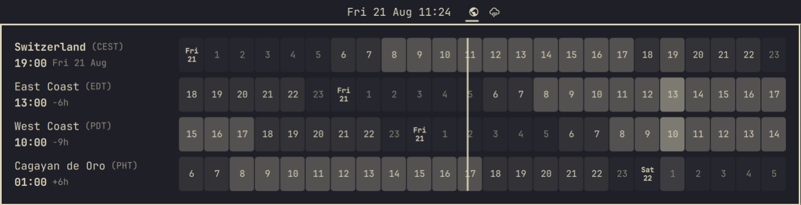

# Timezones

A minimal world clock for the [Omarchy](https://omarchy.org/) bar, inspired by
[worldtimebuddy.com](https://www.worldtimebuddy.com/).

A single globe icon in the bar expands to your zones' current times on hover.
Clicking it opens an hour-grid popup: one 24-hour strip per timezone, all
columns aligned on the same absolute moment, with business hours highlighted,
a "now" line, and day boundaries marked. Hover any column and every row's
header shows that exact moment in its zone — "10am PDT is what in my time?"
answered in one glance, in both directions.

No network, no API: offsets and abbreviations come straight from the system's
tzdata (`TZ=<zone> date`), so summer/winter time is always correct. The home
row follows the **system timezone**, so when you travel and update Omarchy's
timezone, the home row updates with you.

Left Mouse Click Preview:


Hover Preview:


## Install

```sh
omarchy plugin add https://github.com/sspaeti/omarchy-timezones-plugin.git --enable
```

## Usage

- **Hover** the globe icon: compact view, e.g. `NY 07:12 · SF 04:12`
- **Left click**: open/close the hour-grid popup (Escape also closes)
- **Hover a column** in the popup: converts that moment across all zones
- **Middle click**: refresh timezone offsets
- **Right click**: open worldtimebuddy.com in the browser

## Configure

Works out of the box with no configuration: the home row is **Omarchy's
system timezone** (whatever `omarchy` / `timedatectl` is set to), labeled by
its city, plus US East Coast and West Coast as example client zones.

To pick your own zones and labels, configure the widget entry in
`~/.config/omarchy/shell.json` (hot-reloads on save). Example:

```json
{
  "id": "io.github.sspaeti.timezones",
  "homeZones": ["Europe/Zurich", "Europe/Berlin"],
  "zones": [
    { "label": "Switzerland", "shortLabel": "CH", "zone": "", "home": true },
    { "label": "East Coast", "shortLabel": "NY", "zone": "America/New_York" },
    { "label": "West Coast", "shortLabel": "SF", "zone": "America/Los_Angeles" },
    { "label": "Cagayan de Oro", "shortLabel": "CDO", "zone": "Asia/Manila", "abbr": "PHT" }
  ]
}
```

- `zones` — the rows of the popup, top to bottom.
  - `zone` — IANA timezone name; `""` with `"home": true` tracks the system timezone.
  - `label` — the location name shown in the popup.
  - `shortLabel` — used in the bar's hover view.
  - `abbr` — optional override for the timezone abbreviation shown in
    parentheses (tzdata calls the Philippines "PST", which reads wrong next to
    Pacific time — override with "PHT").
- `homeZones` — system timezones that keep the home row's configured label.
  Outside this list (traveling), the home row is relabeled by where the system
  clock actually is. Empty (default): always label by the system timezone.
- `icon` — bar glyph (default `󰇧`).
- `worldtimebuddyUrl` — right-click target.

Move it in the bar:

```sh
omarchy bar move io.github.sspaeti.timezones --section center
```

## Remove

```sh
omarchy plugin remove io.github.sspaeti.timezones
```
